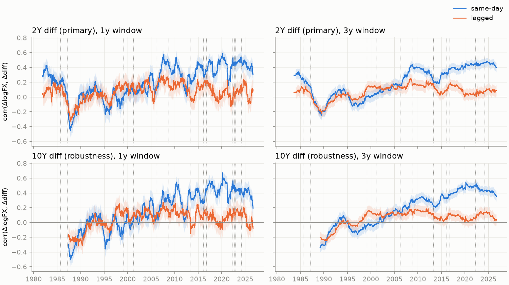
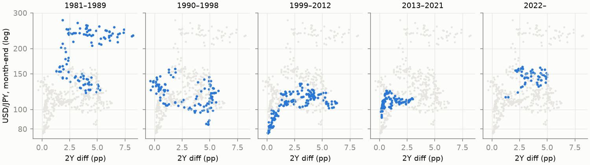

# Project KAGURA

KAGURA is an open quantitative research project on the Japanese yen: USD/JPY, Japanese
monetary policy, FX intervention, market regimes, and their macroeconomic consequences.
It is a research program, not a trading system or a price-prediction app.

**Status: v0.1 in progress.** The data foundation and a first exploratory pass are done.
No formal hypothesis test has been run yet. Nothing in this repository is investment advice.

## Research question

> Has USD/JPY structurally decoupled from the US–Japan interest-rate differential, and if so,
> when and by how much?

## Why it matters

The textbook link between a currency and relative interest rates is one of the most-used
relationships in international macro: when US yields rise relative to Japanese yields,
holding dollars pays more, and USD/JPY tends to rise. For the yen this link carries extra
weight. Japan held policy rates near zero for most of 1999–2024, which made the yen the
classic funding currency for carry trades, and the Bank of Japan and Ministry of Finance
have repeatedly acted on the currency directly (interventions include 1998, 2003–04,
2011, 2022 and 2024).

From 2022 the yen weakened to levels last seen around 1990, and a common narrative
is that it "decoupled" from rate differentials. If that is true, when it happened and how
large the change is matter for how policy transmits to the currency, for how much
intervention can achieve, and for any model that treats the differential as the yen's
anchor. If it is not true, that is worth establishing too.

## Approach

> Economics first. Statistics second. Machine learning third. AI fourth.

Each stage is used only when the previous one cannot answer the question. v0.1 stays in the
first two: economically motivated variables, careful time alignment, descriptive
diagnostics, then simple econometric baselines and structural-break tests. Hypotheses are
written down before the analyses that test them (`docs/HYPOTHESES.md`), exploratory
specifications are frozen in decision records before results are viewed, and negative or
inconclusive results are reported as such.

## v0.1 scope

In scope: reproducible ingestion of USD/JPY, US and Japanese 2Y/10Y government yields,
policy rates and a few macro controls (CPI, Brent, VIX); look-ahead-safe alignment;
exploratory diagnostics; baseline regressions; structural-break analysis; a first
"Yen Fundamental Gap" (the residual between USD/JPY and a fundamentals-implied level).

Out of scope for now: deep learning, LLM pipelines, forecasting, the public dashboard,
and anything resembling a trading system. See `docs/ROADMAP.md` for when those come in.

## Current status

| v0.1 item | Status |
|---|---|
| Reproducible project, tests, lint and type checks | done |
| Ingestion: USD/JPY, US/JGB yields, policy rates, CPI, Brent, VIX | done |
| Time alignment with observation vs availability dating | done (fixed-lag approximation, [ADR 0003](docs/decisions/0003-time-alignment.md)) |
| Exploratory diagnostics and rolling correlations | done (exploratory, [ADR 0004](docs/decisions/0004-h1-exploratory-specification.md)) |
| Baseline regressions with HAC errors, rolling betas | not started |
| Structural-break tests | not started |
| Yen Fundamental Gap v1 | not started |

## Preliminary observations (exploratory)

> **These are exploratory descriptions of the data, not tests of H1 and not causal
> claims.** They come from `notebooks/01_exploration.ipynb`, run on data downloaded on
> 2026-09-15 (daily observations through 2026-09-11). The confidence bands shown assume
> independent observations and are too narrow; they are descriptive only.

1. **In daily changes, the yen has not visibly decoupled from the differential.** The
   rolling correlation of daily USD/JPY log changes with same-day changes in the 2Y
   differential was near zero or negative in roughly 1987–2004 and has been mostly
   between 0.2 and 0.6 since 2008. The latest values (0.30 on the 1-year window, 0.40 on
   the 3-year window) are below the 2020–2025 peak of about 0.45–0.5 (3-year) but within
   the post-2008 range. With the US leg lagged one day, the correlation is
   close to zero throughout, so the comovement is contemporaneous.
2. **In levels, the picture is different.** At a similar 2Y differential (about 2–2.6 pp),
   month-end USD/JPY was about 108 in June 2019 and about 160 in August 2026. But the
   level relationship was never one stable line in this sample (the 1980s cloud shifts by
   roughly 100 yen around the Plaza Accord), so this is a pattern to test, not a finding.
3. **"Decoupling" therefore has at least two meanings**, in changes and in levels, and the
   data treat them differently. H1 has to say which one it tests before a formal test is
   frozen.
4. **Specification implications.** Log USD/JPY behaves like a unit-root process; the
   differentials are borderline. Plain OLS in levels risks a spurious regression, so a
   changes regression with robust errors is the baseline, and any levels analysis needs a
   cointegration framework that allows for breaks. From 1999 to 2022 the 2Y differential
   is essentially the US 2Y yield, and its volatility varies four-fold across eras, so
   rolling slopes and rolling correlations must both be reported.



*Rolling correlation of daily USD/JPY log changes with daily changes in the US–JGB
differential. Dotted lines are policy events fixed in advance (ADR 0004). Bands are
pointwise and too narrow for overlapping windows.*



*Month-end USD/JPY against the 2Y differential. Eras are descriptive labels fixed in
advance, not estimated breaks.*

## Data

All data are fetched from the original public sources by `make data`. **No data are
redistributed in this repository**; `data/raw/` and `data/processed/` are gitignored.

| Series | Source | Frequency |
|---|---|---|
| USD/JPY | FRED `DEXJPUS` (Federal Reserve H.10, noon New York) | daily |
| US 2Y, 10Y Treasury | FRED `DGS2`, `DGS10` | daily |
| Effective fed funds | FRED `DFF` | daily |
| JGB 2Y, 10Y | Japan Ministry of Finance, JGB interest rates | daily |
| Japan call rate | FRED `IRSTCI01JPM156N` (OECD) | monthly |
| US CPI | FRED `CPIAUCSL` (BLS) | monthly |
| Japan CPI | BIS long CPI series `M.JP.628` | monthly |
| Brent | FRED `DCOILBRENTEU` (EIA) | daily |
| VIX | FRED `VIXCLS` (Cboe) | daily |

Terms of use differ by provider, and some FRED series (VIX from Cboe, the OECD call rate)
are third-party copyrighted. Anyone using the data should check each provider's terms.
Source choices and their limitations are recorded in
[ADR 0002](docs/decisions/0002-data-sources.md).

Every run downloads the **current** vintage. Later runs will include newer observations
and any revisions, so numbers can differ slightly from those quoted in the notebook, which
refer to the 2026-09-15 download. The download time of each file is recorded in
`data/raw/manifest.json`.

## Repository layout

```text
src/kagura/
  data.py      download each source, keep raw files unchanged, parse into one long table
  align.py     build daily.csv (USD/JPY calendar) and monthly.csv without look-ahead
  explore.py   exploratory computations and plots; constants frozen by ADR 0004
tests/         parser tests, alignment tests on synthetic data, data-quality checks
notebooks/     01_exploration.ipynb: executed exploratory notebook with dated notes
reports/figures/  figures written by the notebook
docs/
  RESEARCH_SPEC.md   full research program
  ROADMAP.md         versions v0.1 to v1.0
  HYPOTHESES.md      H1–H7, each with what would count as evidence against it
  decisions/         ADRs: sample, sources, alignment, H1 exploratory spec, data guard
```

Reusable research code lives in `src/kagura/`; the notebook only calls it and records
observations.

## Reproducing

Requires [uv](https://docs.astral.sh/uv/) and network access to the sources above.
Python 3.12 is installed by uv if needed.

```bash
make sync      # create the environment from uv.lock
make data      # download sources, build data/processed/{series_long,daily,monthly}.csv
make test      # unit tests plus data-quality tests (warnings are errors)
make lint      # ruff check, ruff format --check, mypy --strict
make research  # re-execute notebooks/01_exploration.ipynb and rewrite reports/figures/
```

Without `make data`, the data-quality tests are skipped and the unit tests still run.

## Research decisions

Consequential choices are recorded as decision records in `docs/decisions/`, each with
context, options considered, decision, rationale and limitations:

- [0001 Sample period](docs/decisions/0001-sample-period.md): modeling sample from 1981.
- [0002 Data sources](docs/decisions/0002-data-sources.md)
- [0003 Time alignment](docs/decisions/0003-time-alignment.md): calendar, carried values,
  release-date lags.
- [0004 H1 exploratory specification](docs/decisions/0004-h1-exploratory-specification.md):
  frozen before results were viewed.
- [0005 Carried-share guard](docs/decisions/0005-carried-share-guard.md): response to a
  Brent source change.

## Known limitations

- Macro release dates are fixed conservative lags, not historical release calendars, and
  CPI values are current vintages rather than real-time vintages (ADR 0003).
- USD/JPY is a noon New York rate, so same-day US yields include a few hours of
  information the FX rate could not yet reflect; both timing variants are reported.
- The Japan policy-rate series starts in July 1985 and the 10Y JGB series in July 1986.
- **Brent source change (ADR 0005).** Downloads after 2026-09-15 are missing 890 historical
  Brent values (1987–2014), which the pipeline fills by carrying and flags. H1 does not use
  Brent. `make data` now warns when any series' carried share exceeds 8%, and `make test`
  fails if that happens to a US or JGB yield.
- Several large one-day moves are flagged for independent-source checks and not yet
  resolved (listed at the end of the notebook).

## Roadmap

| Version | Focus |
|---|---|
| v0.1 | Fundamentals, time alignment, structural breaks, Yen Fundamental Gap v1 |
| v0.2 | Carry, positioning and regimes |
| v0.3 | Out-of-sample forecasting benchmark |
| v0.4 | Policy-event and FX-intervention study |
| v0.5 | Central-bank communication (NLP) |
| v0.6 | Scenario and counterfactual layer |
| v0.7–v1.0 | Research dashboard, paper, presentation, public release |

Details and the conditions for moving on are in `docs/ROADMAP.md`.

## License

The KAGURA source code is released under the [MIT License](LICENSE).

The license covers the code in this repository only. The source datasets are not
included and are not relicensed: data downloaded by `make data` remain subject to each
provider's original terms of use (see [Data](#data)).

## Citation

If you use this work, please cite it using `CITATION.cff`.
